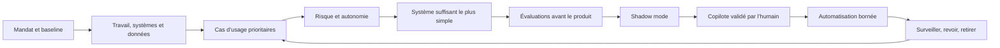

# Playbook d’adoption de l’IA

**Un parcours pratique, gouverné par la preuve, du premier workflow utile jusqu’aux systèmes IA en production.**

[Édition visuelle](site/) · [English](README.md) · [Commencer](docs/universal-process.fr.md) · [Modèles](templates/) · [Sources](references/sources.md)

L’édition visuelle bilingue transforme la méthode en parcours interactif : on
choisit sa structure, on ne révèle que le niveau de détail utile, puis on oriente
les contrôles selon le risque et l’autonomie. Les guides Markdown restent la
source opérationnelle de référence.

**Nouveau :** suivez deux cas synthétiques complets : le
[suivi client d’un indépendant sur 14 jours](examples/fr/independant-suivi-client.md)
et le [traitement des demandes d’une TPE](examples/fr/tpe-demandes-clients.md),
de la baseline jusqu’à une décision de gate conditionnelle.

> État : fondation publique, photographie au **18 août 2026**.

## Pourquoi ce dépôt existe

L’adoption de l’IA échoue souvent lorsqu’une démonstration d’outil est confondue avec un système de travail. Ce playbook part du métier réel, mesure la situation initiale, retient la solution la moins complexe suffisante et exige des preuves avant d’augmenter l’autonomie.

La méthode reste commune, mais la profondeur des contrôles change selon la structure :

| Structure | Point de départ recommandé | Premier horizon utile |
|---|---|---:|
| Indépendant | Un workflow réversible et peu risqué | 14 jours |
| TPE | Un processus partagé, un responsable, une procédure manuelle | 30 jours |
| PME | Portefeuille de cas, plateforme commune et gates formels | 90 jours |
| Association ou fondation | Protection de la mission, des bénéficiaires et des donateurs | 60 jours |
| Service public | Mandat légal, analyse d’impact, audit et recours humain | Par gates |

Choisissez le parcours adapté :

- [Indépendant](tracks/fr/independent.md)
- [TPE](tracks/fr/tpe.md)
- [PME](tracks/fr/pme.md)
- [Association ou fondation](tracks/fr/nonprofit-foundation.md)
- [Service public](tracks/fr/public-sector.md)

## La boucle opérationnelle

Trois règles ne se négocient pas :

1. **Sans propriétaire, baseline et résultat mesurable : pas de projet.**
2. **Sans seuils écrits d’acceptation et d’arrêt : pas de pilote.**
3. **Sans preuves séparées de valeur, sécurité et fiabilité : pas de production.**

## Échelle technique progressive

On commence au niveau le plus bas capable de résoudre le problème. On ne monte que si les évaluations justifient la complexité supplémentaire :

1. processus manuel documenté ;
2. règle déterministe ou automatisation classique ;
3. appel de modèle unique avec sortie structurée ;
4. recherche dans des sources contrôlées ;
5. workflow avec outils et approbation explicite ;
6. agent borné avec moindre privilège ;
7. multi-agent seulement s’il surpasse une architecture plus simple sur des cas réels.

## Démarrage en 60 minutes

1. Ouvrez le [processus universel](docs/universal-process.fr.md).
2. Sélectionnez un [parcours par structure](tracks/fr/).
3. Copiez le [mandat](templates/mandate.fr.md) et la [fiche de cas d’usage](templates/use-case-card.fr.md).
4. Inscrivez les systèmes actuels et envisagés dans le [registre IA](templates/ai-system-register.csv).
5. Ne construisez rien avant la validation du premier gate.

## Ce que contient le playbook

- un cycle de vie universel avec preuves de sortie ;
- une classification risque × autonomie ;
- cinq parcours d’adoption adaptés à la structure ;
- des guides d’évaluation, de sécurité et d’orientation juridique ;
- des registres, questionnaires et runbooks copiables ;
- un registre daté de sources primaires ;
- une validation automatisée du dépôt, sans dépendance externe.

## Périmètre et limites

Ce dépôt est une aide à la mise en œuvre. Il ne constitue ni une certification, ni un avis juridique, de cybersécurité, de protection des données ou d’achat public. Les obligations dépendent du pays, du secteur, du rôle dans la chaîne de valeur IA et du cas concret. Les décisions à fort impact doivent être validées avec les spécialistes qualifiés et les autorités compétentes.

## Fondations

Le playbook rend actionnables, sans reproduire le texte de normes propriétaires :

- ISO/IEC 42001, ISO/IEC 5338, ISO/IEC 23894 et la série ISO/IEC 5259 ;
- NIST AI RMF et son profil Generative AI ;
- les ressources OWASP GenAI et MITRE ATLAS ;
- les orientations suisses et européennes en vigueur à la date de la photographie.

Le [registre des sources](references/sources.md) précise les liens primaires, leur statut et la date de vérification.

## Contribution et licence

Les corrections ciblées, retours de terrain et modèles réutilisables sont bienvenus. Voir [CONTRIBUTING.md](CONTRIBUTING.md). Le dépôt est publié sous [licence MIT](LICENSE).
