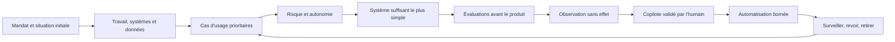

# Playbook d’adoption de l’IA

**Un parcours pratique, gouverné par la preuve, du premier processus métier utile jusqu’aux systèmes IA en production.**

[Guide interactif](https://musyg.github.io/ai-adoption-playbook/fr/) · [Source de l’application visuelle](site/README.md) · [English](README.md) · [Commencer](docs/universal-process.fr.md) · [Modes d’usage IA](docs/ai-use-patterns.fr.md) · [Contrôles JSON](controls/) · [Modèles](templates/) · [Sources](references/sources.md) · [Contribuer](CONTRIBUTING.fr.md) · [Conduite](CODE_OF_CONDUCT.fr.md) · [Sécurité](SECURITY.md)


L’édition visuelle commence par un guide court en cinq étapes. Elle
demande qui vous êtes, ce que l’IA doit faire, jusqu’où elle peut agir, quelle
route juridique s’applique et quel premier pilote est raisonnable. Une seule
question apparaît à la fois. Des bulles simples expliquent les choix moins
familiers, tandis que la méthode détaillée reste rangée dans trois chapitres
fermés jusqu’à leur ouverture. Chaque chapitre n’affiche ensuite qu’un sujet
choisi, et la bibliothèque présente un seul cas d’école à la fois. Le résultat
mène au plan de test, aux contrôles, aux cas comparables et au dossier de
décision Markdown. Les guides Markdown restent la source opérationnelle de
référence.

**Nouveau :** comparez les cas synthétiques complets d’un
[copilote pour indépendant](examples/fr/independant-suivi-client.md), d’une
[boîte partagée de TPE](examples/fr/tpe-demandes-clients.md), d’un
[agent métier de devis B2B pour PME](examples/fr/pme-agent-metier-devis-b2b.md), d’un
[agent administratif de dossiers de subvention pour fondation](examples/fr/association-agent-dossiers-subventions.md), d’un
[agent administratif de dossiers d’urbanisme pour service public](examples/fr/service-public-agent-dossiers-urbanisme.md), d’un
[agent métier borné](examples/fr/independant-agent-metier-suivi.md) et d’une
[agence orchestrée](examples/fr/independant-agence-orchestree-diagnostic.md),
de la situation de départ jusqu’à une décision explicite de périmètre.
Quatre cas non agentiques supplémentaires montrent pourquoi une faible autonomie
n’implique pas un contrat d’évaluation unique : un
[assistant RAG de procédures en lecture seule](examples/fr/assistant-rag-procedures.md),
une [prévision de demande](examples/fr/prevision-demande-pieces.md), un
[chatbot client externe](examples/fr/chatbot-client-externe.md) et un
[assistant multimodal de catalogue](examples/fr/catalogue-multimodal-accessibilite.md).
Les onze cas sont synthétiques et indiquent explicitement les limites de leurs preuves.

> État : version **0.2.2**, dépôt public, photographie au **21 août 2026**. Les guides, parcours, modèles, exemples et l’application visuelle sont disponibles à l’adresse GitHub Pages approuvée.

**Preuves de temps de tâche :** le calculateur interactif part maintenant d’une
tâche comptable, indique si une source publique est comparable et transforme sa
plage basse, centrale et haute en fourchette nette contrainte par votre temps de
préparation, supervision, vérification, correction, exception et mise en place. La
[méthode et les règles de transfert](docs/task-time-evidence.fr.md) expliquent
pourquoi le type d’organisation modifie le contexte et les contrôles sans
définir la référence. Les estimations par modèle, cas fournisseurs et gains
déclarés restent visibles sans devenir des promesses automatiques de
productivité.

**Études publiques et protections sectorielles :** la
[revue de 20 sources publiques](references/field-evidence-review-2026.fr.md)
sépare effets sur une tâche, effets sur le flux éligible, résultats sur toute la
charge, tests comparatifs, télémétrie et cas fournisseurs. Elle ne trouve aucune preuve
causale indépendante d’un multiplicateur générique de 5 à 12 sur les résultats
acceptés. Les extensions [santé](sectors/fr/healthcare.md),
[éducation](sectors/fr/education.md), [finance](sectors/fr/finance.md) et
[infrastructure critique](sectors/fr/critical-infrastructure.md) ajoutent des
conditions bloquantes et des seuils de décision sans remplacer le processus
universel.

Les études publiques et les onze cas d’école ne sont pas des preuves terrain
produites par ce guide. Le registre public est vide. La version `0.3` reste une
version future et ne pourra être achevée qu’après l’admission d’au moins trois
véritables rapports de pilote, revus indépendamment et anonymisés, conformément
au contrat de la cohorte et du registre.

**Validation terrain :** utilisez le
[protocole de pilote terrain](docs/field-pilot-protocol.fr.md) pour préparer un
brouillon local, conserver le dénominateur complet et demander une revue
indépendante avant toute admission d’un résultat anonymisé dans le registre.
Pour coordonner un vrai pilote sans publier les preuves brutes, ouvrez le
[formulaire de prise en charge du pilote](https://github.com/Musyg/ai-adoption-playbook/issues/new?template=field-pilot-fr.yml).

Les numéros désignent des choses distinctes : `0.2.2` est la version du dépôt,
les étapes `01` à `05` sont les décisions du parcours court, les phases `0` à
`11` forment la méthode complète, `A0` à `A4` indiquent l’autonomie et `R0` à
`R3` le niveau de risque.

## Pourquoi ce dépôt existe

L’adoption de l’IA échoue souvent lorsqu’une démonstration d’outil est confondue avec un système de travail. Ce playbook part du métier réel, mesure la situation initiale, retient la solution la moins complexe suffisante et exige des preuves avant d’augmenter l’autonomie.

La méthode reste commune, mais la profondeur des contrôles change selon la structure :

| Structure | Point de départ recommandé | Premier horizon utile |
|---|---|---:|
| Indépendant | Un processus réversible et peu risqué | 14 jours |
| TPE | Un processus partagé, un responsable, une procédure manuelle | 30 jours |
| PME | Portefeuille de cas, plateforme commune et seuils formels | 90 jours |
| Association ou fondation | Protection de la mission, des bénéficiaires et des donateurs | 60 jours |
| Service public | Mandat légal, analyse d’impact, audit et recours humain | Par étapes de validation |

Choisissez le parcours adapté :

- [Indépendant](tracks/fr/independent.md)
- [TPE](tracks/fr/tpe.md)
- [PME](tracks/fr/pme.md)
- [Association ou fondation](tracks/fr/nonprofit-foundation.md)
- [Service public](tracks/fr/public-sector.md)

## La boucle opérationnelle



Trois règles ne se négocient pas :

1. **Sans responsable, situation initiale et résultat mesurable : pas de projet.**
2. **Sans seuils écrits d’acceptation et d’arrêt : pas de pilote.**
3. **Sans preuves séparées de valeur, sécurité et fiabilité : pas de production.**

## Échelle technique progressive

On commence au niveau le plus bas capable de résoudre le problème. On ne monte que si les évaluations justifient la complexité supplémentaire :

Commencer par identifier le [mode d’usage de l’IA](docs/ai-use-patterns.fr.md).
Type de tâche, interaction, source de connaissance, déploiement, impact et
autonomie sont des dimensions séparées. Un assistant documentaire et un
classifieur prédictif peuvent partager une autonomie A1 tout en exigeant des
preuves différentes.

1. processus manuel documenté ;
2. règle déterministe ou automatisation classique ;
3. appel de modèle unique avec sortie structurée ;
4. recherche dans des sources contrôlées ;
5. processus avec outils et approbation explicite ;
6. agent borné avec moindre privilège ;
7. multi-agent seulement s’il surpasse une architecture plus simple sur des cas réels.

## Démarrage en 60 minutes

1. Ouvrez le [processus universel](docs/universal-process.fr.md).
2. Sélectionnez un [parcours par structure](tracks/fr/).
3. Ajoutez l’[extension sectorielle](sectors/fr/) lorsque le travail touche la santé, l’éducation, la finance ou une infrastructure critique.
4. Copiez le [mandat](templates/mandate.fr.md) et la [fiche de cas d’usage](templates/use-case-card.fr.md).
5. Inscrivez les systèmes actuels et envisagés dans le [registre IA](templates/ai-system-register.csv).
6. Ne construisez rien avant le premier point de décision validé.

## Ce que contient le playbook

- un cycle de vie universel avec preuves de sortie ;
- une taxonomie des modes génération, recherche augmentée,
  classification, prédiction, conversation, multimodal et agentique ;
- une classification risque × autonomie ;
- cinq parcours d’adoption adaptés à la structure ;
- quatre extensions pour la santé, l’éducation, la finance et les infrastructures critiques ;
- des profils d’évaluation et de sécurité propres au mode, avec routage juridique
  séparé pour la Suisse et l’Union européenne ;
- des registres, analyses d’accessibilité et de droits fondamentaux, questionnaires et procédures d’exploitation copiables ;
- un référentiel JSON versionné reliant contrôles, applicabilité, preuves, points de décision et sources ;
- un registre daté de sources primaires ;
- une validation automatisée du dépôt, sans dépendance externe ;
- des contrôles automatisés de TypeScript, des dépendances, de l’accessibilité,
  de l’export statique et du rendu navigateur.

## Validation du dépôt

Depuis `site/`, installez les dépendances verrouillées et lancez la vérification
complète :

```bash
npm ci
npm run verify
python ../scripts/validate.py
```

L’export statique reste neutre vis-à-vis de l’hébergeur et utilise `noindex` par
défaut. Il ne produit ni origine canonique ni sitemap tant que
`PUBLIC_SITE_URL` n’est pas défini pour un hébergeur explicitement approuvé.
`STATIC_BASE_PATH` permet ensuite de servir l’application sous un sous-chemin.
Le processus GitHub Pages fournit ces deux valeurs lors de la construction pour l’URL
publique approuvée, sans modifier l’export local neutre.

## Périmètre et limites

Ce dépôt est une aide à la mise en œuvre. Il ne constitue ni une certification, ni un avis juridique, de cybersécurité, de protection des données ou d’achat public. Les obligations dépendent du pays, du secteur, du rôle dans la chaîne de valeur IA et du cas concret. Les décisions à fort impact doivent être validées avec les spécialistes qualifiés et les autorités compétentes.

## Fondations

Le playbook rend actionnables, sans reproduire le texte de normes propriétaires :

- ISO/IEC 42001, ISO/IEC 5338, ISO/IEC 23894 et la série ISO/IEC 5259 ;
- NIST AI RMF et son profil Generative AI ;
- les ressources OWASP GenAI et MITRE ATLAS ;
- les orientations suisses et européennes en vigueur à la date de la photographie.

Le [registre des sources](references/sources.md) précise les liens primaires, leur statut et la date de vérification.

## Contribution et licence

Les corrections ciblées, retours de terrain et modèles réutilisables sont bienvenus. Voir [CONTRIBUTING.fr.md](CONTRIBUTING.fr.md). Le dépôt est publié sous [licence MIT](LICENSE).
