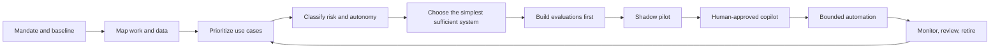

# AI Adoption Playbook

**A practical, evidence-gated path from the first useful AI workflow to governed production systems.**

[Visual edition](site/) · [Version française](README.fr.md) · [Start here](docs/universal-process.md) · [JSON controls](controls/) · [Templates](templates/) · [Sources](references/sources.md)

The bilingual visual edition turns the method into an interactive path: distinguish
copilot, business-agent, and orchestrated-agency integration; calibrate a realistic
range; turn it into a preregistered pilot protocol; enter the observed evidence; then
make a bounded gate decision and generate a reversible operating card with monitoring,
suspension, rollback, and dated reassessment; finally, export the complete chain as a
reviewable Markdown decision dossier. The Markdown guides remain the operational source
of truth.

**New:** compare the complete synthetic cases for an
[independent copilot](examples/en/independent-client-follow-up.md), a
[micro-business shared inbox](examples/en/tpe-customer-requests.md), a
[B2B quote business agent for an SME](examples/en/sme-b2b-quote-business-agent.md), a
[grant-dossier administrative agent for a foundation](examples/en/nonprofit-grant-dossier-business-agent.md), a
[planning-dossier administrative agent for a public service](examples/en/public-sector-planning-dossier-business-agent.md), a
[bounded business agent](examples/en/independent-business-agent-follow-up.md), and an
[orchestrated agency](examples/en/independent-orchestrated-agency-diagnostic.md),
from baseline and pre-registered thresholds to an explicit scope decision.

> Status: public foundation, snapshot **2026-08-19**. Operating guides, organization tracks, templates, worked examples, and the visual edition are available in English and French.

## Why this repository exists

AI adoption fails when a tool demo is mistaken for an operating model. This playbook starts with the actual work, measures the baseline, chooses the least complex sufficient system, and requires evidence before autonomy increases.

It scales across five contexts without pretending their controls should be identical:

| Context | Recommended entry path | First useful horizon |
|---|---|---:|
| Independent professional | One reversible, low-risk workflow | 14 days |
| Micro-business (TPE) | One shared process with an owner and fallback | 30 days |
| Small or medium enterprise (PME) | Portfolio, common platform and formal gates | 90 days |
| Nonprofit or foundation | Mission, beneficiary and donor safeguards | 60 days |
| Public service | Legal mandate, impact assessment, audit and human recourse | Stage-gated |

Open the matching implementation track:

- [Independent professional](tracks/en/independent.md)
- [Micro-business / TPE](tracks/en/tpe.md)
- [SME / PME](tracks/en/pme.md)
- [Nonprofit or foundation](tracks/en/nonprofit-foundation.md)
- [Public service](tracks/en/public-sector.md)

## The operating loop

Three rules are non-negotiable:

1. **No owner, baseline or measurable outcome: no project.**
2. **No written acceptance and stop thresholds: no pilot.**
3. **No separate evidence for value, safety and reliability: no production.**

## Progressive technical ladder

Start at the lowest level that can solve the problem and only move upward when evaluation evidence justifies the added complexity:

1. documented manual process;
2. deterministic rule or conventional automation;
3. single model call with structured output;
4. retrieval over controlled sources;
5. workflow with tools and explicit approval;
6. bounded agent with least privilege;
7. multi-agent system only when it outperforms a simpler design on real cases.

## What is included

- a universal lifecycle with explicit evidence gates;
- risk × autonomy classification;
- adoption tracks for each organization type;
- evaluation, security and legal orientation;
- copy-ready registers, assessment forms and runbooks;
- a versioned JSON crosswalk connecting controls, applicability, evidence, gates, and sources;
- a dated register of primary sources;
- dependency-free repository validation in CI.

## Quick start

1. Read the [universal process](docs/universal-process.md).
2. Select one organizational [track](tracks/en/).
3. Copy the [mandate](templates/mandate.md) and [use-case card](templates/use-case-card.md).
4. Record every current or proposed system in the [AI register](templates/ai-system-register.csv).
5. Do not build until the first gate is satisfied.

## Scope and limits

This repository is an implementation aid, not a certification scheme and not legal, procurement, security or data-protection advice. Requirements depend on jurisdiction, sector, role in the AI value chain and the concrete use case. Validate high-impact decisions with qualified specialists and the competent authorities.

## Foundations

The playbook operationalizes, without reproducing proprietary standards:

- ISO/IEC 42001 (AI management systems), ISO/IEC 5338 (AI system life cycle), ISO/IEC 23894 (AI risk management), and the ISO/IEC 5259 data-quality series;
- NIST AI RMF and its Generative AI Profile;
- OWASP GenAI guidance and MITRE ATLAS;
- current Swiss data-protection guidance and EU AI Act implementation material.

See the [source register](references/sources.md) for primary links, status notes and verification dates.

## Contributing and license

Focused corrections, field reports and reusable templates are welcome. See [CONTRIBUTING.md](CONTRIBUTING.md). The repository is released under the [MIT License](LICENSE).
